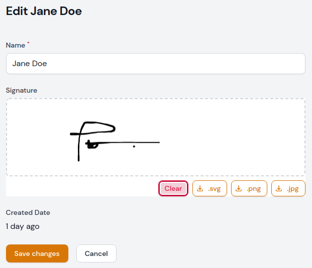

# Signature Pad Field for Filamentphp Forms

[](https://packagist.org/packages/savannabits/filament-signature-pad)
[](https://github.com/savannabits/filament-signature-pad/actions?query=workflow%3Arun-tests+branch%3Amain)
[](https://github.com/savannabits/filament-signature-pad/actions?query=workflow%3A"Check+%26+fix+styling"+branch%3Amain)
[](https://packagist.org/packages/savannabits/filament-signature-pad)



This is where your description should go. Limit it to a paragraph or two. Consider adding a small example.

## Installation

You can install the package via composer:

```bash
composer require savannabits/filament-signature-pad
```

## Usage

You can now use the SignaturePad field in your form builder. 
```php
    use Savannabits\SignaturePad\Forms\Components\Fields\SignaturePad;
    public static function form(Form $form): Form
    {
        return $form
            ->schema([
                // ... Other fields
                SignaturePad::make('signature'), // Chain your field modifiers here
                // Other fields
            ]);
    }
```
You can also set the Signature Pad Options as shown below. [See SignaturePad Options Docs](https://github.com/szimek/signature_pad#options) for more details.
```php
    use Savannabits\SignaturePad\Forms\Components\Fields\SignaturePad;
    public static function form(Form $form): Form
    {
        return $form
            ->schema([
                // ... Other fields
                SignaturePad::make('signature')
                    ->strokeMinWidth(1.0)
                    ->strokeMaxWidth(2.5)
                    ->strokeDotSize(2.0)
                    ->penColor('rgb(0,0,255)') // Blue
                    ->backgroundColor('rgba(0,0,0,0)'), // Black Transparent
                // Other fields
            ]);
    }
```


## Testing

```bash
composer test
```

## Changelog

Please see [CHANGELOG](CHANGELOG.md) for more information on what has changed recently.

## Contributing

Please see [CONTRIBUTING](.github/CONTRIBUTING.md) for details.

## Security Vulnerabilities

Please review [our security policy](../../security/policy) on how to report security vulnerabilities.

## Credits

- [Sam Maosa](https://github.com/savannabits)
- [All Contributors](../../contributors)

## License

The MIT License (MIT). Please see [License File](LICENSE.md) for more information.
